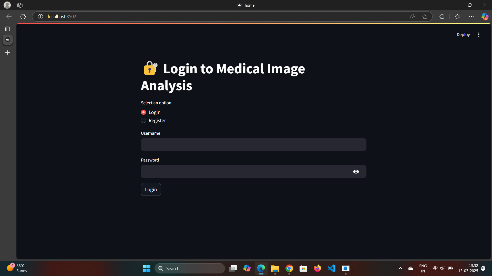
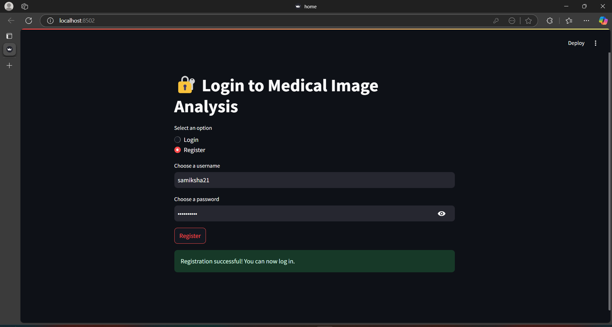
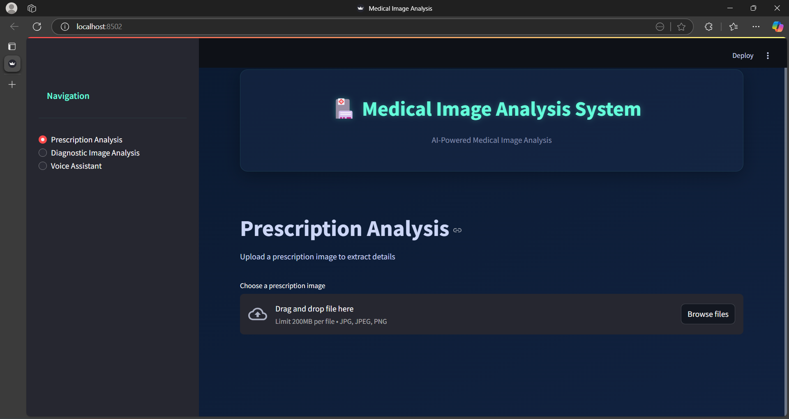
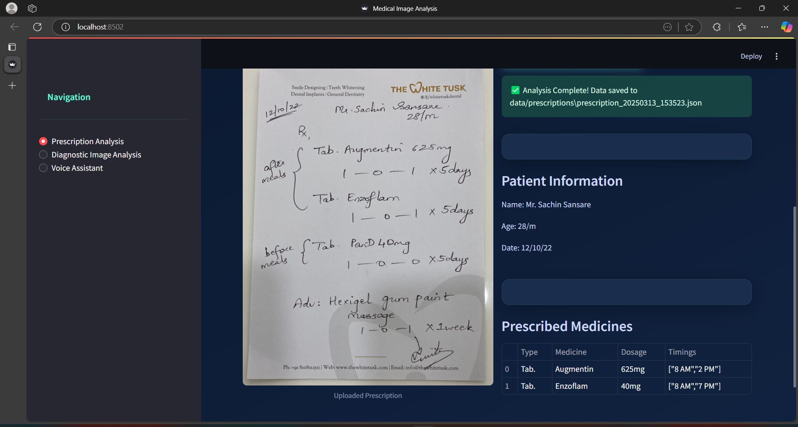
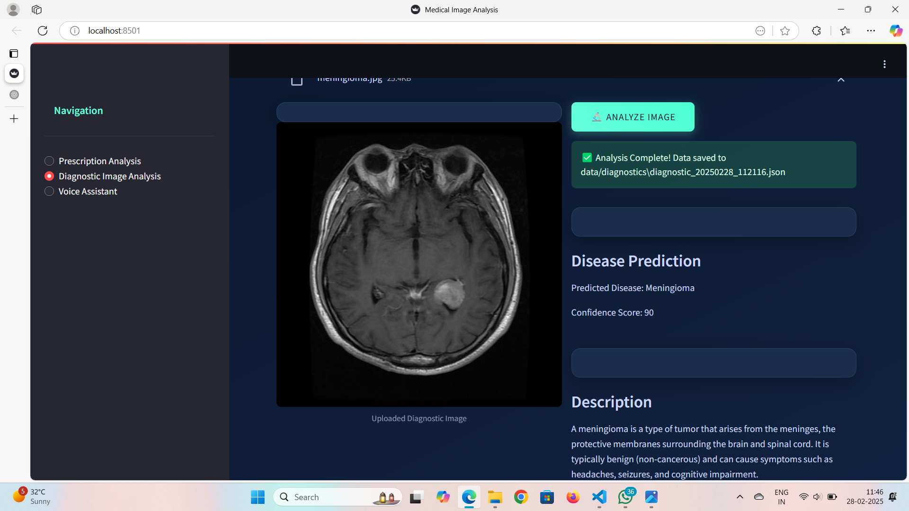
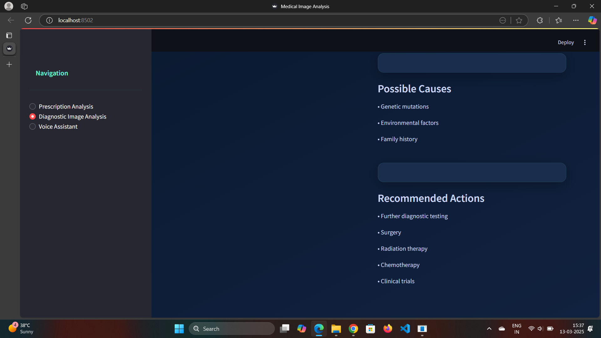
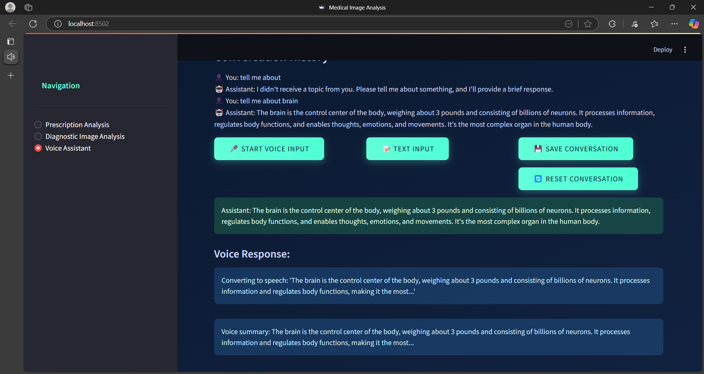
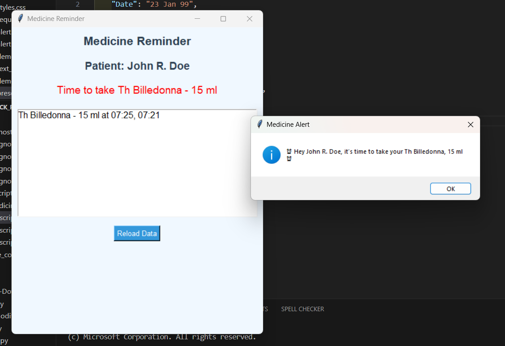

# 📌 Mediclock_Project - AI-Powered Voice-Assisted Medical Reminder System  

## 📖 Overview  
**Mediclock** is an AI-powered healthcare assistant that helps users efficiently manage their **medication schedules**. It leverages **voice recognition** and **text-to-speech (TTS) technology**, allowing users to interact with the system through spoken commands.  

This project aims to **enhance medication adherence**, making it easier for users—especially the elderly—to follow their prescribed medications **without hassle**.  

---

## ✨ Key Features  
✅ **Voice-Assisted Reminders** – Automatic reminders for taking medications on time.  
✅ **Speech Recognition & Text-to-Speech (TTS)** – Users can give voice commands, and the system responds using AI-generated speech.  
✅ **Prescription Management** – Stores and retrieves prescription details to help users keep track of medications.  
✅ **Diagnostic Records** – Maintains a history of medical diagnoses and prescriptions for easy access.  
✅ **User-Friendly Interface** – Built using **Streamlit** for a simple, interactive experience.  

---

## 🔧 Technologies Used  
- 🐍 **Python** – Core logic and AI-powered speech processing  
- 🌐 **Streamlit** – Interactive web interface  
- 🎙️ **SpeechRecognition & gTTS** – For voice commands and speech output  
- 📂 **JSON & File Handling** – Securely stores prescriptions and user data  

---

## 🚀 Installation & Setup  

### 1️⃣ Prerequisites  
Ensure you have the following installed:  
- **Python (3.8 or later)** – [Download Here](https://www.python.org/downloads/)  
- **pip (Python package manager)**  
- **Virtual Environment (Recommended for dependencies)**  

---

### 2️⃣ Clone the Repository  
Open your terminal or command prompt and run:  

git clone https://github.com/yourusername/Mediclock_Project.git
cd Mediclock_Project

---

## 🚀 How It Works  
1️⃣ Users **set up their medication schedules** by providing prescription details.  
2️⃣ The system **listens to voice commands** and retrieves relevant medication reminders.  
3️⃣ At scheduled times, it **provides spoken reminders** using text-to-speech technology.  
4️⃣ Users can **check past prescriptions and medical history** stored in the system.  

---

## 🖼️ Screenshots  
  
 
 
 

 
 

---

## 🎯 Conclusion  
**Mediclock** enhances healthcare accessibility using **AI and automation**. With its **hands-free, voice-assisted approach**, it ensures users—especially elderly patients—can manage their medications effortlessly. The intuitive interface and powerful voice recognition capabilities make **Mediclock a reliable healthcare companion**.  

---

### 🤝 Contributers
This project was developed by:  
- **Samiksha More**  
- **Mohini Giri**  

---

📌 *Developed with ❤️ for better healthcare management!*  

